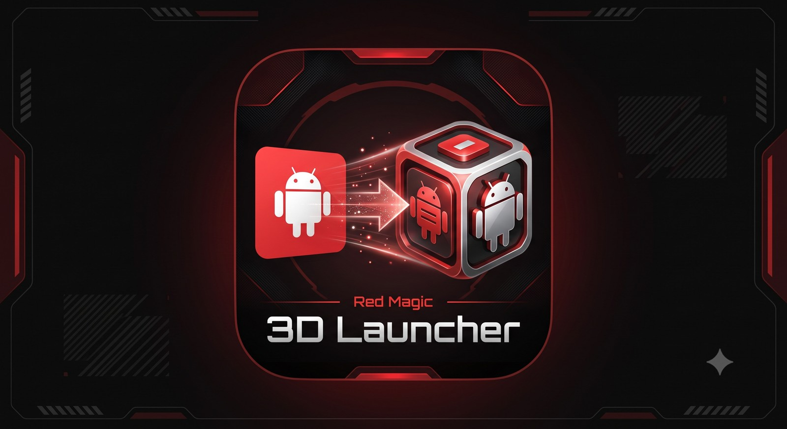

# 3D Launcher for the Red Magic 3D tablet

[한국어](README.md) | **English**



**Run any installed app in glasses-free 3D.** Games, YouTube and other ordinary 2D apps are converted by the tablet's own
Leia 2D-to-3D engine and shown on the 3D panel. Touch and the back gesture work as usual.

- Device: **Red Magic 3D Explorer Edition tablet (NP02J) only.** It does not work on other devices.
- No root needed, but you do need the **Shizuku** app (see below).
- In side-by-side tests on the tablet, the 3D looked better and stuttered less than the built-in "3D mode".

> The app's screens are in Korean for now. The Korean labels you will see are given below with their meaning.

---

## Installation

### 1. Get the two apps
- **3D Launcher**: `RedMagic-3D-Launcher-*.apk` from [Releases](https://github.com/nautymac/RedMagic-3D-Launcher/releases/latest)
- **Shizuku**: the apk from [Shizuku Releases](https://github.com/RikkaApps/Shizuku/releases/latest), or "Shizuku" on Google Play

Install both on the tablet. Tap the apk in a file manager and allow "Install unknown apps" if asked.

### 2. Turn on Developer options (once)
Settings → About tablet → **tap Build number 7 times** until you see "You are now a developer".

### 3. Pair Shizuku (once)
1. Connect to Wi-Fi.
2. Open **Shizuku** → "Start via Wireless debugging" → **Pairing**. Allow notifications if asked.
3. Settings → Developer options → turn on **Wireless debugging**, open it, and tap **"Pair device with pairing code"**. A 6-digit code appears.
4. Pull down the notification shade and type that code into the Shizuku notification's input field.
5. When the "Pairing successful" notification appears, you're done.

### 4. Start Shizuku
Shizuku → **Start**. When the top of the screen says "Shizuku is running", it's working.

> **Stuck on "Searching for wireless debugging service"?** On some Wi-Fi networks Shizuku can't find the wireless
> debugging port. Try another network (a phone hotspot, for example). If you have a PC, run the `adb` command shown in
> Shizuku's "Start by connecting to a computer" section once. Shizuku then stays running until the next reboot.

### 5. Open 3D Launcher
Open 3D Launcher, tap **권한 요청** (Request permission) and allow it. When the top line shows **준비됨** (Ready),
you're set.

---

## How to use

| To | Do this |
|---|---|
| Run an app in 3D | Tap it in the list |
| Change per-app settings | **Long-press** the app: favorite (즐겨찾기), 2D→3D conversion or SBS, depth (깊이) |
| Show only favorites | Use the **즐겨찾기만 / 전체 보기** (Favorites only / Show all) button at the top |
| Go back inside the app | Use the back gesture as usual |
| Adjust depth or exit | Swipe in from a screen edge to reveal the system bars. A bar with **나가기** (Exit) and **깊이 − +** (Depth) appears at the top |

- Leaving the 3D screen closes the app too. If the app closes itself, the 3D screen closes as well.
- If the app is already running when you launch it, it is closed and started fresh.
- **SBS mode**: for apps that draw a left/right image pair themselves (such as an emulator's SBS output), choose "SBS" in that app's settings.

## After a reboot
Pairing and permissions stay. Just **turn on Wireless debugging → tap Start in Shizuku**.
Android turns Wireless debugging off on every reboot, which is a limit of unrooted devices.

## Troubleshooting
- **"도우미 연결이 늦어지고 있습니다"** (Helper is taking long to connect): this happens after "Clear all" in recent apps,
  which closes the Shizuku app too. Tap **Shizuku 열기** (Open Shizuku), then come back and it reconnects.
  **Lock the 3D Launcher and Shizuku cards in recent apps** to avoid this entirely.
- **"Shizuku 가 꺼져 있습니다"** (Shizuku is off): the tablet rebooted or Shizuku stopped. Start Shizuku again (step 4).
- **Black screen**: copy-protected apps such as Netflix can't be shown in 3D.
- **"이 앱은 3D 화면에서 실행되지 않았습니다"** (This app didn't run on the 3D screen): some apps and games refuse to run on a secondary display.

---

## For developers

### Structure
- `HelperService`: a helper with shell permissions, started by Shizuku as a UserService (not a daemon, so it dies with the app).
  It creates and releases a trusted virtual display, runs `cmd activity start-activity --display N`, injects touch and keys,
  and counts the tasks on the display. Shell permissions are needed because other apps can't be launched on a virtual
  display created by an ordinary app (`Not allow to launch ... on display N`).
- `Helper`: the app side of the Shizuku connection, permission and binding. A stuck bind is retried after 8 seconds.
- `MainActivity`: app picker, per-app settings, favorites.
- `ViewActivity`: the 3D screen.
  ```
  [2D]  app ─▶ virtual display 1920x1200 = engine input ─▶ Leia 2D→3D engine ─▶ CNSDK input ─▶ weaving
  [SBS] app ─▶ virtual display 3840x1200 = CNSDK input ───────────────────────────────────▶ weaving
  touch ─▶ mapped to display coordinates ─▶ helper ─▶ injectInputEvent(displayId)
  ```
  The 2D-to-3D engine is the device's `com.leiainc.media.service`, loaded with DexClassLoader (`LeiaMediaSDK.java`).

### Build
`gradlew.bat assembleRelease` → `app/build/outputs/apk/release/app-release.apk`

The Leia CNSDK connector comes from the device's CalibrationK68 system app, so it isn't in this repository. Add these yourself to build:
- `app/libs/leia-cnsdk.jar`
- `app/src/main/jniLibs/arm64-v8a/libleiaCore-loader.so`, `libleiaSDK-jni.so`
- `app/src/main/assets/shaders/`, `app/src/main/assets/cnsdk.version`

How to extract them, and the same file set, are the same as the redmagic flavor of [DepthFlix](https://github.com/nautymac/DepthFlix).

Logs: `adb logcat -s L3D L3DHelper P3DLeiaMl`
